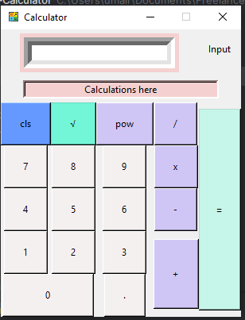

Sure! Below is a sample README file for your calculator project.


# Calculator Application

A simple calculator application built with Python and Tkinter. This calculator supports basic arithmetic operations as well as square root and power functions.


## Screenshots

A preview of how it looks and functions.



## Features

- Basic arithmetic operations: addition, subtraction, multiplication, and division.
- Square root and power functions.
- Clear (reset) functionality.
- GUI with a responsive and user-friendly interface.

## Installation

1. **Clone the repository:**

   ```bash
   git clone https://github.com/your-username/calculator-app.git
   cd calculator-app
   ```

2. **Ensure you have Python installed:**

   Make sure you have Python 3.x installed on your system. You can download it from [python.org](https://www.python.org/).

3. **Install Tkinter:**

   Tkinter usually comes pre-installed with Python. If it's not installed, you can install it via pip:

   ```bash
   pip install tk
   ```

4. **Run the application:**

   Navigate to the directory where you cloned the repository and run the `calculator.py` file:

   ```bash
   python calculator.py
   ```

## Usage

The calculator has a user-friendly interface with buttons for each digit, basic arithmetic operations, square root, power, and clear functionality.

### Buttons

- **Digits (0-9)**: Press these buttons to input numbers.
- **Arithmetic Operations**: `+`, `-`, `x`, `/` buttons for addition, subtraction, multiplication, and division respectively.
- **Special Functions**: 
  - `\u221A`: Square root.
  - `pow`: Power.
- **Clear**: `cls` button to reset the input and clear the display.
- **Decimal Point**: `.` button to input decimal numbers.
- **Equals**: `=` button to calculate and display the result.

### Example Calculations

1. **Addition**: To add 5 and 3, press `5`, `+`, `3`, `=`.
2. **Square Root**: To find the square root of 16, press `16`, `\u221A`, `=`.
3. **Power**: To calculate 2 raised to the power of 3, press `2`, `pow`, `3`, `=`.


## Contributing

Contributions are welcome! Please fork the repository and submit a pull request with your changes.

